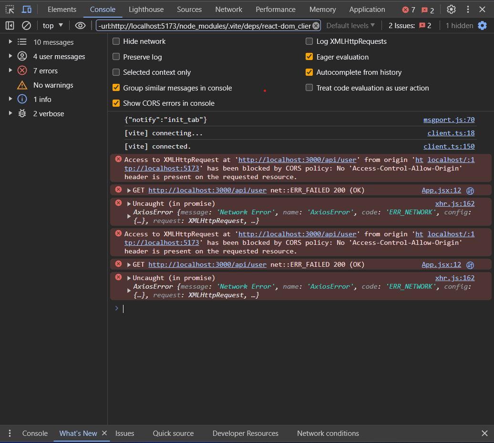

# Frontend And Backend Connection MERN

## Getting Started with Production-Level Backend And Frontend Connection

🚀 Welcome to the MERN (MongoDB, Express.js, React.js, Node.js) stack guide for setting up a production-level connection between your backend and frontend.

## Table of Contents

1. [Project Setup Guide](#project-setup-guide)
   1. [Backend Server Creation](#1-backend-server-creation)
      - [1.1 Create a Node file](#11-create-a-node-file)
      - [1.2 Package.json File](#12-packagejson-file)
      - [1.3 What is NPM](#13-what-is-npm)
      - [1.3 Difference Between `package.json` and `package-lock.json`](#13-difference-between-packagejson-and-package-lockjson)
      - [1.4 Required NPM Packages for Backend Development](#14-required-npm-packages-for-backend-development)
        - [1.4.1 `cors`](#141-cors)
        - [1.4.2 `express`](#142-express)
        - [1.4.3 `Nodemon`](#143-nodemon)
      - [1.5 Create a Backend Server](#15-create-a-backend-server)
        - [1.5.1 Index.js File](#151-indexjs-file)
        - [1.5.2 Run Backend Server](#152-run-backend-server)
   2. [Frontend Server Creation](#2-frontend-server-creation)
      - [2.1 What is React.js?](#21-what-is-reactjs)
      - [2.2 What is Vite.js?](#22-what-is-vitejs)
      - [2.3 What is tool chain/builders?](#23-what-is-tool-chainbuilders)
      - [2.4 How to create a Frontend app using Vite JS?](#24-how-to-create-a-frontend-app-using-vite-js)
      - [2.5 Vite React App Directory Structure](#25-vite-react-app-directory-structure)
2. [JSON Formatter](#json-formatter)
   - [Online Json Formator link](#online-json-formator-link)
   - [Key Features of JSON Formatters](#key-features-of-json-formatters)
   - [Examples](#examples)
3. [Handling CORS Errors in Backend and Frontend](#handling-cors-errors-in-backend-and-frontend)
   - [What is CORS Error?](#what-is-cors-error)
   - [Handling CORS Error in Backend](#handling-cors-error-in-backend)
     - [3.1 Install `cors` NPM Package](#31-install-cors-npm-package)
     - [3.2 Implementation CORS Middleware in Backend](#32-implementation-cors-middleware-in-backend)
   - [Handling CORS Error in Frontend](#handling-cors-error-in-frontend)
     - [3.3 Read The Documentation of vite Server Options](#33-read-the-documentation-of-vite-server-options)
   - [3.4 Deployment](#34-deployment)

# Project Setup Guide

## 1. 💻 Backend Server Creation

### 1.1 Create a node file

To kickstart our backend server, we'll create a Node.js file. Use the following commands:

```bash
npm init
```


This will initiate the package.json setup for your Node.js project.

### 1.2 Package.json File

Now, let's take a look at the generated `package.json` file. Ensure that it includes the necessary dependencies for your backend development, such as Express.js, Mongoose (for MongoDB connectivity), etc.


### 1.3 What is NPM

Node Package Manager (NPM) is a package manager for JavaScript and enables you to install third-party libraries or modules directly from the npm registry

### 1.3 Difference Between `package.json` and `package-lock.json`

## `package.json`

The `package.json` file is a metadata file in a Node.js project that contains various configuration settings and metadata about the project. It includes information such as project name, version, description, entry points, scripts, and dependencies.

### Key Characteristics:

1. **Dependency Listings:**

   - Lists the project's dependencies.
   - Specifies the versions or version ranges of the dependencies required for the project.

2. **Scripts:**

   - Defines custom scripts that can be executed using npm.
   - Common scripts include `start`, `test`, and `build`, among others.

3. **Metadata:**
   - Contains general information about the project, such as author, license, and repository.

## `package-lock.json`

The `package-lock.json` file is automatically generated by npm to provide a detailed, version-locked representation of the project's dependency tree. It ensures that the same dependencies and their versions are installed across different environments.

### Key Characteristics:

1. **Version Locking:**

   - Provides an exact, deterministic record of the versions of each installed package.
   - Ensures that installations are reproducible and consistent.

2. **Integrity Check:**

   - Includes a cryptographic hash for each installed package to verify the integrity of the installed packages.
   - Guarantees that the installed packages match the expected versions.

3. **Dependency Tree:**
   - Represents the entire dependency tree, including nested dependencies.
   - Resolves and records the specific versions used, preventing unintended version changes.

## Summary

In summary, while `package.json` serves as a high-level configuration file with dependency information, `package-lock.json` is a low-level, detailed representation of the dependency tree with version locking and integrity checks. Both files work together to ensure consistent and reliable dependency management in Node.js projects.

### 1.4 Required NPM Packages for Backend Development

To enhance the functionality and development experience of your Node.js backend application, you'll need to install the following NPM packages:

## 1. `cors`

### Installation:

```bash
npm i cors
```

#### Purpose :

The `cors` package is used to enable Cross-Origin Resource Sharing (CORS) in your Express.js application. CORS is a security feature implemented by web browsers to restrict web pages from making requests to a different domain than the one that served the web page. cors helps in handling CORS headers, allowing your backend to accept requests from different origins.

## 2. `express`

### Installation:

```bash
npm i express
```

#### Purpose :

`express` is a fast, unopinionated, minimalist web framework for Node.js. It simplifies the process of building robust and scalable web applications. With features like middleware support, routing, and HTTP utility methods, `express` is a popular choice for building RESTful APIs and web servers.

## 2. `Nodemon`

### Installation:

```bash
npm i -D nodemon
```

#### Purpose :

`nodemon` is a development tool that helps in automatically restarting the Node.js application when file changes are detected. This is especially useful during development as it saves you from manually stopping and restarting the server after every code modification. The `-D` flag indicates that `nodemon` is a development dependency, meaning it is not needed in the production environment.

## Create a Backend Server

[Index.js File](Code/backend/index.js)

### Run Backend Server

To start the server, you can use the following command in your terminal from within the `/backend` directory:
Run command :

```bash
npm i

npm run dev
```

Server Run Successfully

## 2. 🌐 Frontend Server Creation

### 2.1 What is React.js?

React.js is a JavaScript library for building user interfaces. It allows developers to create reusable UI components and efficiently update the UI in response to data changes. React follows a component-based architecture, making it easy to manage and scale complex applications.

### 2.2 What is Vite.js?

Vite.js is a fast, modern, and lightweight frontend build tool for JavaScript and TypeScript applications. It aims to provide a quicker development experience by leveraging native ES modules and optimizing the build process. Vite is commonly used with frameworks like React, Vue, and others.

### 2.3 What is tool chain/builders?

A toolchain or builder in the context of frontend development refers to a set of tools and processes used to automate tasks such as bundling, minification, transpilation, and more. It helps streamline the development workflow and prepares the code for production deployment.

### 2.4 How to create a Frontend app using Vite JS?

To create a frontend app using Vite JS, follow these steps:

```bash
# Install Vite globally (if not already installed)
npm install -g create-vite

# Create a new Vite project
create-vite my-frontend-app

# Navigate to the project directory
cd my-frontend-app

# Install dependencies
npm install

# Start the development server
npm run dev
```

# Vite React App Directory Structure

When you create a Vite.js project with React, the directory structure is designed to provide a clean and organized layout for your frontend application. Below is an explanation of the key directories and files:

```
|-- src
|   |-- components
|   |-- styles
|   |-- App.jsx (or App.tsx)
|   |-- main.jsx (or main.tsx)

|-- public
|-- dist
|-- node_modules
|-- vite.config.js
|-- package.json
|-- tsconfig.json (or jsconfig.json)
|-- yarn.lock (or package-lock.json)
|-- .gitignore
|-- .prettierrc
|-- .eslintrc
```

## `src`

The `src` directory contains the source code of your React application. This is where you will spend most of your development time.

### `src/components`

This directory is for React components. You can organize your components based on their functionality or use case.

### `src/styles`

Place your global styles or CSS modules here. Vite supports importing CSS directly into JavaScript files.

### `src/App.jsx` or `src/App.tsx`

The main entry point for your React application. This is where you typically import and render your top-level components.

### `src/main.jsx` or `src/main.tsx`

The entry file for your Vite app. It imports and mounts the root component (`App`) and configures any global settings.

## `public`

The `public` directory is for static assets that do not need processing by bundlers, like images or fonts.

## `dist`

This is the output directory where Vite builds your project for production. It contains the optimized and bundled code.

## `node_modules`

The `node_modules` directory contains the dependencies and packages installed for your project.

## `vite.config.js`

The `vite.config.js` file is the configuration file for Vite. You can customize settings such as plugins, build options, and development server configurations.

## `package.json`

The `package.json` file contains metadata about your project, as well as scripts and dependencies.

## `tsconfig.json` or `jsconfig.json`

If your project uses TypeScript, you'll have a `tsconfig.json` file for TypeScript configuration. For JavaScript projects, it might be `jsconfig.json`.

## `yarn.lock` or `package-lock.json`

These files lock the versions of your dependencies, ensuring consistent installs across different environments.

## `.gitignore`

The `.gitignore` file specifies files and directories that Git should ignore.

## `.prettierrc` and `.eslintrc`

These files are configuration files for Prettier and ESLint, respectively. They define code style rules and formatting preferences.

---

This directory structure provides a modular and scalable foundation for developing React applications with Vite.js. Customize it based on your project's specific needs and complexity.

# JSON Formatter

### Online Json Formator [link](https://jsonformatter.org/)

A JSON formatter is a tool or program that aids in presenting JSON (JavaScript Object Notation) data in a more readable and structured format. JSON is commonly used for data interchange in web applications and other systems.

## Key Features of JSON Formatters

### 1. **Indentation**

JSON formatters apply proper indentation to the JSON data, making it easier to understand the structure and hierarchy of nested elements.

### 2. **Coloring**

Some JSON formatters use syntax highlighting to colorize different elements within the JSON data. This visual aid helps distinguish keys, values, and strings for better readability.

### 3. **Sorting**

Certain JSON formatters provide the option to sort keys alphabetically. This feature can be useful for consistency or when comparing JSON objects.

### 4. **Validation**

JSON formatters often include a validation feature to check if the provided JSON data adheres to the correct format. This helps identify syntax errors or other issues in the JSON structure.

## Examples

Consider the following unformatted JSON data:

```json
{
  "firstName": "John",
  "lastName": "Doe",
  "age": 30,
  "email": "john.doe@example.com",
  "address": {
    "street": "123 Main Street",
    "city": "Cityville",
    "zipCode": "12345"
  },
  "phoneNumbers": [
    {
      "type": "home",
      "number": "555-1234"
    },
    {
      "type": "work",
      "number": "555-5678"
    }
  ]
}
```

# Handling CORS Errors in Backend and Frontend

## What is CORS Error?

CORS (Cross-Origin Resource Sharing) is a security feature implemented by web browsers to prevent web pages from making requests to a different domain than the one that served the web page. A CORS error occurs when a web application attempts to make a request to a different domain, and the server does not include the necessary CORS headers to allow the request.



## Handling CORS Error in Backend

### 1. Install `cors` NPM Package

```bash
npm install cors
```

### 2. Implementation CORS Middleware in Backend

```js
const express = require("express");
const cors = require("cors");
const app = express();

// Enable CORS for all routes
app.use(cors());

// Your other middleware and routes...

const PORT = process.env.PORT || 3000;
app.listen(PORT, () => {
  console.log(`Server is running on port ${PORT}`);
});
```

> > For Extra Handling Read The Documentation of cors

## Handling CORS Error in Frontend

### Read The Documentation of vite Server Options

[https://vitejs.dev/config/server-options.html](https://vitejs.dev/config/server-options.html)

```js
import { defineConfig } from "vite";
import react from "@vitejs/plugin-react";

// https://vitejs.dev/config/
export default defineConfig({
  plugins: [react()],
  server: {
    proxy: {
      "/api/user": "http://localhost:3000",
    },
  },
});
```

## 3. Deployment

nodemon is a development tool that helps in automatically restarting the Node.js application when file changes are detected. This is especially useful during development as it saves you from manually stopping and restarting the server after every code modification. The -D flag indicates that nodemon is a development dependency, meaning it is not needed in the production environment.

## Contribution and Feedback

We encourage you to actively participate in this series. If you have suggestions, questions, or find errors, feel free to contribute and provide feedback through GitHub issues or pull requests. Your input will help improve the content and make it even more valuable to the community.

## Connect with Me

Stay connected with me for more insights and updates on Production Level Backend Development:

- GitHub: [](https://github.com/CoderSwarup)
- Instagram: [](https://www.instagram.com/swarup_bhise999/)

Let's embark on a journey to become a skilled backend developer and create amazing web applications.

**Happy Coding!** 🎉
