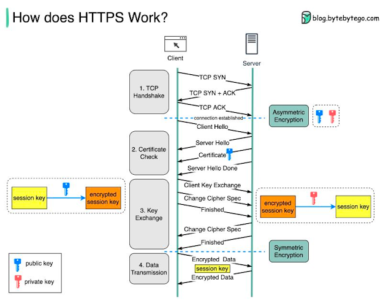

# HTTP CRASH COURSE

## Table of Contents

1. [Getting Started with HTTP](#getting-started-with-http)
   1. [HTTP](#1-http)
   2. [Main Difference Between HTTP VS HTTPS](#2-main-difference-between-http-vs-https)
   3. [WORKING OF CLIENT SERVER](#3-working-of-client-server)
   4. [Acronyms](#4-acronyms)
   5. [HTTP Headers](#5-http-headers)
      1. [Metadata](#51-metadata)
      2. [Caching, Authentication, Manage State](#52-caching-authentication-manage-state)
      3. [Header Types](#53-header-types)
      4. [Most Common Headers](#54-most-common-headers)
         1. [Simple Headers](#541-simple-headers)
         2. [CORS Headers](#542-cors-headers)
         3. [Security Headers](#543-security-headers)
   6. [HTTP Methods](#6-http-methods)
   7. [Status Code](#7-status-code)
   8. [MIME Type](#8-mime-type)
2. [Connect with Me](#-connect-with-me)

## Getting Started with HTTP

### 1. HTTP

> **HTTP STANDS FOR**

Hypertext Transfer Protocol

### 2. Main Difference Between HTTP VS HTTPS

The main difference between HTTP (Hypertext Transfer Protocol) and HTTPS (Hypertext Transfer Protocol Secure) lies in the security aspect. HTTPS is a secure version of HTTP, and the key differences are:

- **Security:** HTTP is not secure, and the data exchanged between the user's browser and the website is transmitted in plain text. HTTPS, on the other hand, uses encryption (usually SSL/TLS) to secure the communication, ensuring that the data is encrypted and cannot be easily intercepted by malicious entities.

- **Protocol:** HTTP operates over a standard TCP (Transmission Control Protocol) connection. In contrast, HTTPS uses a secure version of the HTTP protocol, adding a layer of security through SSL/TLS protocols.

### 3. WORKING OF CLIENT SERVER

The working of a client-server interaction involves the following steps:

1. **Client Sends a Request:**

   - The process begins with the client (e.g., a web browser) sending a request to the server. This request typically includes information about the resource the client is trying to access, such as a webpage or a file.

2. **Server Processes the Request:**

   - Upon receiving the request, the server processes it based on the specified resource and the type of request (e.g., GET, POST). The server may perform various tasks, such as fetching data from a database, processing business logic, or generating dynamic content.

3. **Server Sends a Response:**

   - After processing the request, the server sends a response back to the client. This response contains the requested resource or information, along with relevant metadata, status codes, and headers.

4. **Client Receives and Renders the Response:**

   - The client, upon receiving the response, interprets the data and renders it for the user. In the case of a web browser, this may involve displaying a webpage with text, images, and other multimedia elements.

5. **Stateless Communication:**

   - HTTP, the protocol commonly used in client-server interactions, is stateless. This means that each request from the client is independent, and the server does not retain any knowledge of previous requests. To maintain continuity, mechanisms like cookies or sessions are often used.

6. **Protocols and Standards:**
   - The communication between the client and server relies on standardized protocols such as HTTP or HTTPS. These protocols define the rules for how data is formatted, transmitted, and received.

Understanding the client-server model is fundamental to the architecture of many web-based applications, where clients (users' devices) interact with servers (computers hosting resources or services) to access and exchange data.

### 4. Acronyms

1. **URL**

   - **Full Form:** Uniform Resource Locator
   - **Description:** A URL is a web address that specifies the location of a resource on the internet. It typically includes the protocol (e.g., http, https), domain name, and path to the resource.

2. **URI**

   - **Full Form:** Uniform Resource Identifier
   - **Description:** A URI is a string of characters that uniquely identifies a particular resource. It can be a URL, URN, or both.

3. **URN**

   - **Full Form:** Uniform Resource Name
   - **Description:** A URN is a URI that identifies a resource by name in a particular namespace. Unlike URLs, which specify how to access a resource, URNs are used to identify resources by name in a persistent and location-independent manner.

4. **DNS**
   - **Full Form:** Domain Name System
   - **Description:** The Domain Name System is a hierarchical system that translates human-readable domain names into IP addresses, allowing computers to locate and connect to each other on the internet.

- **IP**

  - **Full Form:** Internet Protocol
  - **Description:** IP is a set of rules governing the format of data sent over the internet. It is an essential protocol for communication between devices on a network.

- **HTML**

  - **Full Form:** Hypertext Markup Language
  - **Description:** HTML is the standard markup language for creating web pages. It structures content on the web and is often used in conjunction with CSS (Cascading Style Sheets) and JavaScript.

- **FTP**

  - **Full Form:** File Transfer Protocol
  - **Description:** FTP is a standard network protocol used to transfer files from one host to another over a TCP-based network, such as the internet.

- **TCP**

  - **Full Form:** Transmission Control Protocol
  - **Description:** TCP is one of the main protocols in the Internet Protocol Suite. It provides reliable, ordered, and error-checked delivery of data between devices over a network.

- **SSL**

  - **Full Form:** Secure Sockets Layer
  - **Description:** SSL is a cryptographic protocol designed to secure communication over a computer network. It is commonly used to provide secure data transfer over the internet.

- **HTTP**
  - **Full Form:** Hypertext Transfer Protocol
  - **Description:** HTTP is the foundation of any data exchange on the Web. It is a protocol used for transmitting hypertext via the internet.

### 5. HTTP Headers

#### 5.1 Metadata

- Every data sent over the internet is called metadata.
- It includes information about the data like size, type, etc.

#### 5.2 Caching, Authentication, Manage State

- **Caching:** If a web page or image doesn't change frequently, it can be cached on the server so that the next time a page is not changed, we don't need to send it again and again. We store this page in cache memory so that the next time the same request comes, we can serve it from there itself.
  - `Expires`: Date after which the page will expire.
  - `Last Modified`: Date of the last modification of the resource on the server.
  - `Etag`: Entity Tag, represents the state of the resource on the server.

#### 5.3 Header Types

- 5.3.1 Request Header: Contains information from the client to the server.
- 5.3.2 Response Header: Contains information from the server to the client.
- 5.3.3 Representation Headers
- 5.3.4 Payload Headers

#### 5.4 Most Common Headers

##### 5.4.1 Simple Headers

| Field             | Description                               | Example Value                                                                                                |
| ----------------- | ----------------------------------------- | ------------------------------------------------------------------------------------------------------------ |
| `Host`            | Domain name of the server                 | www.example.com                                                                                              |
| `User-Agent`      | Browser or application used by the client | Mozilla/5.0 (Windows NT 6.1; Win93. AppleWebKit/537.36 (KHTML, like Gecko) Chrome/88.0.4324.96 Safari/537.36 |
| `Accept`          | What format the client can understand     | text/html,application/json                                                                                   |
| `Referer`         | Where did you come from                   | http://www.example.com/page1.html                                                                            |
| `Accept-Language` | Language that the client prefers          | en-US,en                                                                                                     |
| `Content-Type`    | Type of data being sent                   | application/x-www-form-urlencoded                                                                            |
| `Authorization`   | Authentication info for the user          | Basic YWxhZGRpbjpvcGVuIHNlc2VrYQ==                                                                           |
| `Allow`           | Methods supported by the resource         | GET, POST                                                                                                    |
| `Server`          | Software used by the server               | Apache/2.4.7 (Ubuntu)                                                                                        |
| `Location`        | New location for further action           | [https://www.google.co.in/](https://www.google.co.in/)                                                       |
| `Content-Length`  | Size of the entity-body                   | Length of the file                                                                                           |
| `Connection`      | Connection options                        | Keep-Alive, Close                                                                                            |

##### 5.4.2 CORS Headers

- `Access-Control-Allow-Origin`
- `Access-Control-Allow-Credentials`
- `Access-Control-Allow-Methods`

##### 5.4.3 Security Headers

- `Access-Control-Embedded-Policy`
- `Access-Control-Open-Policy`
- `X-Frame-Options`
- `X-XSS-Protection`
- `Content-Security-Policy`

---

### 6. HTTP Methods

- The request method is case-sensitive and should be one of the following: GET, HEAD, POST, PUT, DELETE, OPTIONS, TRACE.
- Each method has a purpose:

  - There are 8 types of HTTP requests

    | Name    | Safe | Idempotent | Definition                                                     |
    | ------- | ---- | ---------- | -------------------------------------------------------------- |
    | OPTIONS | Yes  | No         | Describes the communication options for the target resource    |
    | GET     | Yes  | Yes        | Retrieve information                                           |
    | HEAD    | Yes  | Yes        | Same as GET but only header                                    |
    | POST    | No   | No         | Submit data to specified URI                                   |
    | PUT     | No   | Yes        | Upload data to the server                                      |
    | DELETE  | Yes  | Yes        | Delete specified information                                   |
    | TRACE   | Yes  | Yes        | Used to invoke a remote connection                             |
    | OPTIONS | Yes  | Yes        | Describes the communication options for the target resource    |
    | CONNECT | No   | No         | Create a tunnel to transfer data between the client and server |

### 7. Status Code

- **0xx**: Informational - The request was received, continuing process
- **1xx**: Successful - The request was successfully received, understood, and accepted
- **2xx**: Redirection - Further action must be taken to complete the request
- **3xx**: Client Error - The request could not be completed because the client sent invalid syntax or unsupported request method or changed any requested object in an uncompleted manner. The request could not be processed because of a client error (e.g., syntax error)
- **4xx**: Server Error - Server had an internal problem that prevented it from fulfilling the request
- **5xx**: Internal Server Error - Server error occurred while processing the request

---

### 8. MIME Type

MIME type defines the media type and format of the data being sent. It consists of two parts separated by a forward slash (`/`): the media type and the subtype.

## 🤝 Connect with Me

You can find me on GitHub, where I share my coding projects, collaborate with others, and explore open-source contributions:

- Linkedin: 

For a more personal touch, you can follow me on Instagram:

